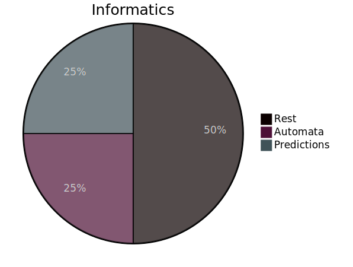
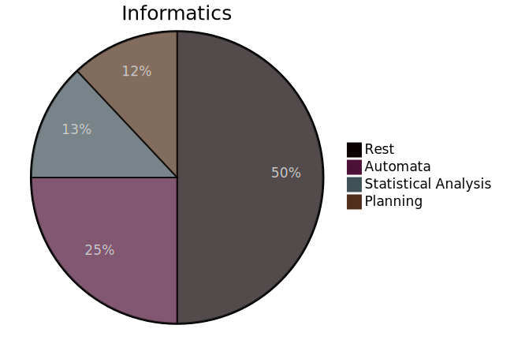

# Real OOP

Raphael Diener 29.04.24

note:

Hi, my name is Raphael and I'll talk a bit about Object Oriented Programming.
Since the time is quite limited I'll not take any questions and will be going pretty fast.

---

I will actively disagree    
with multiple lecturers at this college!

note: 
I will need you full attention, because I will be straight up contradicting
many of the things lecturers at this college will tell you about Object Oriented Programming
Meaning I will not only discuss the subject at hand, 
but also the mess we as developers find our self's in and how to deal with that

---

## What even is OOP

---

| Component                      | Times mentioned |
| ------------------------------ | --------------- |
| encapsulation                  | 16              |
| inheritance                    | 15              |
| Objects with data and behavior | 14              |
| polymorphism                   | 13              |
| abstraction                    | 12              |
| reusability                    | 7               |
| class                          | 6               |
| modularity                     | 6               |
| extensibility                  | 5               |
| security                       | 4               |
| interface                      | 4               |
| design patterns                | 2               |
| efficiency                     | 2               |
| coupling                       | 1               |
| cohesion                       | 1               |
| messages                       | 1               |
| persistence                    | 1               |
| scalability                    | 1               |

note:

So, What even is OOP?

I looked at the top 20 hits on google and found the following associations, but lets just focus on the top 5, since I'm on a timer.

- [techtarget.com](https://www.techtarget.com/searchapparchitecture/definition/object-oriented-programming-OOP)
- [spiceworks.com](https://www.spiceworks.com/tech/devops/articles/object-oriented-programming/)
- [educative.io](https://www.educative.io/blog/object-oriented-programming)
- [geeksforgeeks.org](https://www.geeksforgeeks.org/introduction-of-object-oriented-programming/)
- [developer.mozilla.org](https://developer.mozilla.org/en-US/docs/Learn/JavaScript/Objects/Object-oriented_programming)
- [wikipedia.org](https://de.wikipedia.org/wiki/Objektorientierte_Programmierung)
- [indeed.com](https://www.indeed.com/career-advice/career-development/what-is-object-oriented-programming)
- [freecodecamp.org](https://www.freecodecamp.org/news/what-is-object-oriented-programming/)
- [w3schools.com](https://www.w3schools.com/cpp/cpp_oop.asp)
- [realpython.com](https://realpython.com/python3-object-oriented-programming/)
- [codeinstitute.net](https://codeinstitute.net/de/blog/object-oriented-programming/)
- [techtarget.com](https://www.techtarget.com/searchapparchitecture/definition/object)
- [learn.microsoft.com](https://learn.microsoft.com/en-us/dotnet/csharp/fundamentals/tutorials/oop)
- [coursera.org](https://www.coursera.org/articles/object-oriented-programming-languages)
- [freecodecamp.org](https://www.freecodecamp.org/news/object-oriented-programming-concepts-21bb035f7260/)
- [adv-r.hadley.nz](https://adv-r.hadley.nz/oo.html)
- [sciencedirect.com](https://www.sciencedirect.com/topics/computer-science/object-oriented-programming)
- [w3schools.com](https://www.w3schools.com/java/java_oop.asp)
- [mathworks.com](https://www.mathworks.com/products/matlab/object-oriented-programming.html)

---

- encapsulation
- inheritance
- Objects with data and behavior
- polymorphism
- abstraction

note:

The first thing we notice is that is not a definition that can stand on it's own.
This is merely a game of association.
This is already a bad start.
But one might try to argue, that we could treat it as a aggregate. A shorthand.
This is also misguided.
To illustrate this quickly, lets look at the overcharged term "AI"
 
---

<grid drag="50 50" drop="25 25">
![[mermaid-diagram-2024-04-14-180206.svg]] <!-- element style="object-fit: cover" -->
</grid>

note:

AI is also a aggregated term describing a wide spectrum of Informatics,
which itself is a fraction of mathematics.
Artificial itelligence describes the part of Informatics and Computer science,
which concerns it self with decision making.

---

<grid drag="50 50" drop="1 25">
<!-- element style="object-fit: cover" -->
</grid>
<grid drag="50 50" drop="-1 -25">
<!-- element style="object-fit: cover" -->
</grid>

note:

We can further and further subdivide the area until we arrive at a granularity at which we can have meaningful discussions.

---

- encapsulation
- inheritance
- Objects with data and behavior
- polymorphism
- abstraction

note:

But this is something we can't do with this definition of OOP.
It is simply so broad that it encapsulates all of Informatics.
A naive person might conclude from that, 
that OOP just hints at something fundamental at the heart of Informatics, but it doesn't.

Let me demonstrate:

---

# Encapsulation

note:

Encapsulation is a good thing.
It helps us bundling stuff together and increasing cohesion as well as reduces coupling to internals.

But I don't need the quote on quote "OOP features" to do so.

---

# Encapsulation

- somefile.c
- somefile.h

note:

We could do it already in C and and we do it in even older programming languages.
The associated features don't fundamentally help with encapsulation

---

# Inheritance & Polymorphism

note:

Let's look next at inheritance and polymorphism.
They are exactly the same.

---

# Inheritance & Polymorphism

- Subtype Polymorphism
- Parametric Polymorphism
- Ad Hoc Polymorphism
- Row Polymorphism
- (Rank Polymorphism)
- (Coercion Polymorphism)
- ...

note:

We know many different types of polymorphisms and inheritance is simply another one.
Depending on the implementation it inheritance can be a subtyping, and ad hoc- or an parametric polymorphism,
and the term "inheritance" alone is not adequate enough to describe what one is talking about. 

[Wikipedia - Polymorphism](https://en.wikipedia.org/wiki/Polymorphism_(computer_science))

---

# Inheritance & Polymorphism

![[Pasted image 20240414165908.png]]

note:

And again, this is something that we had for way longer.
This is an example of a function definition in SML, 
of just one of the polymorphism which are the foundation of inheritance.
I put SML on this slide because the online interpreter gives readable output,
but honestly we could do stuff like this since the 60's with LISP.

[SML interpreter](https://sosml.org/)

---

# Abstraction

![[Pasted image 20240414165908.png]]

note:

We also see that claiming abstraction is something related to OOP is meaningless.
We are doing that longer than we even can compute.
Have you heard of mathematics? 

---

# Objects with data and behavior


```c
typedef struct { 
  float data1; 
  int data2; 
  void *function1; 
} MyClass;
``` 

note:

And as for associating functionality with the data;
that's also boring.
Here is an example in C.
If that was all there is to classes, then [Bjarne](https://en.wikipedia.org/wiki/Bjarne_Stroustrup "Bjarne Stroustrup") wouldn't have to make Cpp. 

---

![[Pasted image 20240415012327.png|1920x1200]]

note:

These terms are incredibly imprecise and don't communicate a paradigm.
A paradigm is a way of looking at problems.
All this does is communicate what you do when you apply the paradigm of OOP, 
and not how you see the world.
And even then; they don't focus on the things that are at the hart of OOP and instead on superficials.

---

## What even is OOP

note:

So we come back to the question: What does OOP even mean?!

---

![[Pasted image 20240413213600.png]]

note:

So lets follow common wisdom and start or search on Wikipedia.
There, we can find out, that this thingy originated from a chap called Alan Kay.

---

![[Pasted image 20240413213727.png]]

note:

if we now google for his name, we will find the C2 wiki, 
which is already a step up from normal Wikipedia.
The C2 wiki will give us the following definition.

---

## A better definition

1. Everything Is An Object 
2. Objects communicate by sending and receiving messages (in terms of objects).
3. Objects have their own memory (in terms of objects).
4. Every object is an instance of a class (which must be an object).
5. The class holds the shared behavior for its instances (in the form of objects in a program list)
6. To eval a program list, control is passed to the first object and the remainder is treated as its message.

[wiki.c2](https://wiki.c2.com/?AlanKaysDefinitionOfObjectOriented)

note:

This is already a more useful definition than whatever the other pages gave us.
But this is just small talk. Not the essence of OOP.

---

![[Pasted image 20240413214152.png]]

[Seminar with Alan Kay on Object Oriented Programming (VPRI 0246)](https://www.youtube.com/watch?v=QjJaFG63Hlo)

note:

So lets dig a bit more, and if you do, you will find the following seminar that Alan Kay gave 
and that miraculously made it to the internet age.

In there Alan describes the following.

---

![[mermaid-diagram-2024-04-14-180141.svg]]<!-- element style="object-fit: cover" -->

What Java OOP does to simple programs

note:

In traditional notions of notating software, you are required to couple software.
And this is simply an approach which doesn't scale.
When trying to control complexity and growth of software projects,
he studied other complex systems in the real world: Biology.

---

![[Pasted image 20240415204846.png]]<!-- element style="object-fit: cover" -->

note:

No single cell knows of the existence of another cell.
They ain't coupled.
But how do they communicate?
Through messages.
And who delivers the messages?
The environment.
This is exactly why the BEAM and the small talk virtual machine work the way they do.
To enable message passing without coupling.

---

> I'm sorry that I long ago coined the
> term "objects" for this topic because it gets many people to focus on the
> lesser idea.

 \- Alan Kay

note:

this is exactly how the famous quote came into existence.
OOP is about messaging.
Communication and connectivity is the bottleneck on complex systems.
Not data modeling.

---

# How to program that

note:

If we now take it back to programming, how are we even supposed to annotate that?
The normal links which we are used to, simply don't exist.

---

![[Pasted image 20240415015402.png]]

That's the neat part; you don't!

note:

and that's the neat part. you don't.
Who cares about the outside world?
Your object doesn't.

---

![[Pasted image 20240415015646.png]]

[Reactive Systems • Dave Farley • GOTO 2019](https://www.youtube.com/watch?v=tKRa0O7aepo)

note:

All it wants is to receive some information,
work on that information,
and maybe shout something out in the ether.
That's nothing more than a two ring buffer setup.

So, but they have to communicate somehow. 
So what takes care of distributing the messages?

---

![[Pasted image 20240415210037.png]]

[Lukas Larsson - Understanding the Erlang Scheduler](https://www.youtube.com/watch?v=tBAM_N9qPno)

note:

The answer is named the BEAM scheduler in case of erlang,
but any old scheduling algorithm will do.

---

# OOP is a worldview

note:

So if ring-buffers and schedulers all there is to writing object oriented programs,
then we can see that OOP is not about any particular language.
It is a way of seeing the world as composed of multiple asynchronous isolated computations.
It is a paradigm.

---

# OOP vs FP is a false dichotomy

note:

And as all paradigms,
they are not mutually exclusive.
When I see a horse, I see a animal.
When a person from a hundred years ago saw a horse, he saw a transportation vehicle.
But horses are still horses.
Those are simply point of views.

---

(What downsides has OOP)

---

(What we get from OOP)

---

(how change started to creep in)

---

(understanding information spread)

---

(Cargo cults are universally a bad thing)

---

(The consequence is that a quick search for OOP on a more up to date platform like YouTube, will more likely look like this)

![[Pasted image 20240413214727.png]]
![[Pasted image 20240413214929.png]]

(The continuous spread of misinformation and hearsay without even the slightest attempt of figuring out what even is behind it is baffling!)

---

(
And now teachers are in a bind. 
They have 2 options:
1. either telling you how it is used in the industry and help you communicate with coworkers
2. or tell you what it means and risk propagating the "college doesn't teach real world myth"
I think I've made my position clear, but I am NOT blaming the teachers!
They just made a decision. I don't agree with it, but it's their decision and I can understand it.
)

---

(Solution: Separate into Class Oriented Programming and OOP)

---

(Example categorization of languages into class and object oriented)

---

Go and build better, more reliable systems!


All links and references were retrieved on the 13th April 2024
Download the Presentation from my repo

---


![[pexels-andrea-piacquadio-834863.jpg]]
[Photo by Andrea Piacquadio](https://www.pexels.com/photo/man-sitting-on-chair-beside-table-834863/)
